# Hi, I'm Djawad 👋  
💻 **Professional Full-Stack Developer** | Django • Django Rest FrameWork • React • TypeScript • Tailwind • Next.js  
📱 Android Developer (Kotlin & Jetpack Compose)  

---

## 🚀 Professional Profile
- 🎯 Specialized in building **modern, scalable, and user-focused web apps**.  
- 🌟 Strong expertise in **React, Next.js, TypeScript, TailwindCSS, and Django**.  
- 🔧 Experienced in **full-stack development (frontend + backend + APIs + deployment)**.  
- 📱 Additional skills in **Android development (Kotlin & Jetpack Compose)**.  
- 🌍 Based in **Algeria**, open to remote opportunities worldwide.  

---

# 🌱 Currently Learning
📌 Expanding into advanced backend and system design:  
- ⚡ Scalable architectures  
- 🧠 System design & performance optimization
- ⚡ Devops

---

## 🛠️ Tech Stack

### ⚙️ Backend & Tools

### 🎨 Frontend

### 📱 Mobile

### 🛠 Other Tools

---

## 🏆 Certificates
🎓 **React Developer Certificate**  
*(Proof of professional expertise in React and Django ecosystem)*  

📸 *Certificate Preview:*  

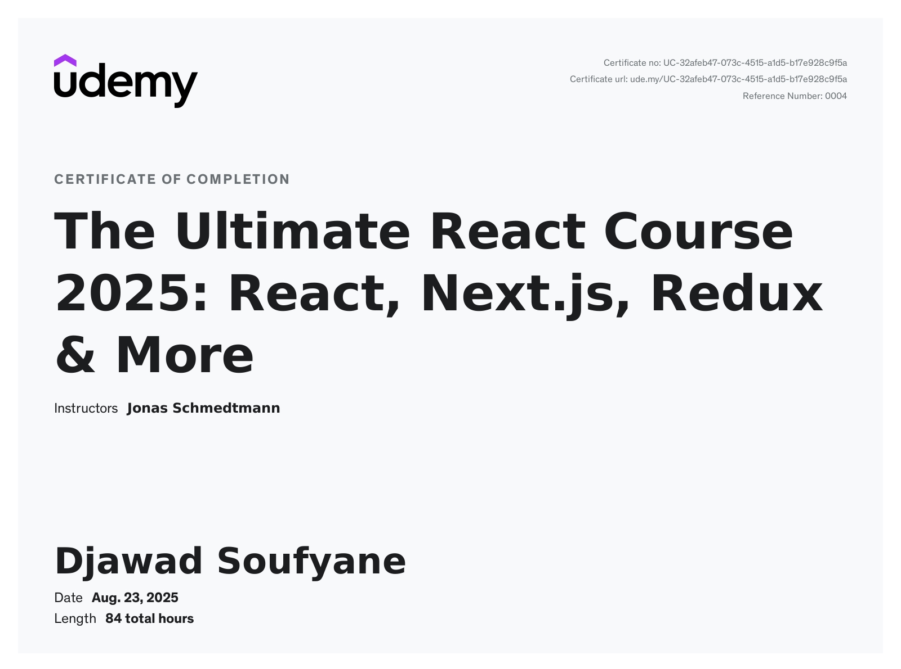  

---

## 🚀 Major Projects

> 🛠 projects were developed as part of **team collaborations**, where I played a key role in development and system integration.

---

### 🔹 🏢 Lift & Cable Installation Company Management Platform

Full enterprise management system developed for a company to manage projects, inventory, invoices, and maintenance operations.

✅ Full project lifecycle: client registration → project creation → verification → assignment → maintenance  
✅ Advanced inventory management with stock tracking and profit calculations  
✅ Invoice system with multi-line products and financial tracking  
✅ Interactive calendar for scheduling and planning  
✅ Secure authentication with JWT + role-based access (admin / assistant)  
✅ Statistics dashboard with project and profit analytics  

**Tech Stack**  
Frontend: React, TypeScript, Tailwind CSS  
Backend: Django , Django REST Framework ,SSE 
DataBase : Postgesql
DevOps: Docker

🌐 **Production:** http://5.135.241.51/  

📸 *Some Screenshots:*  

  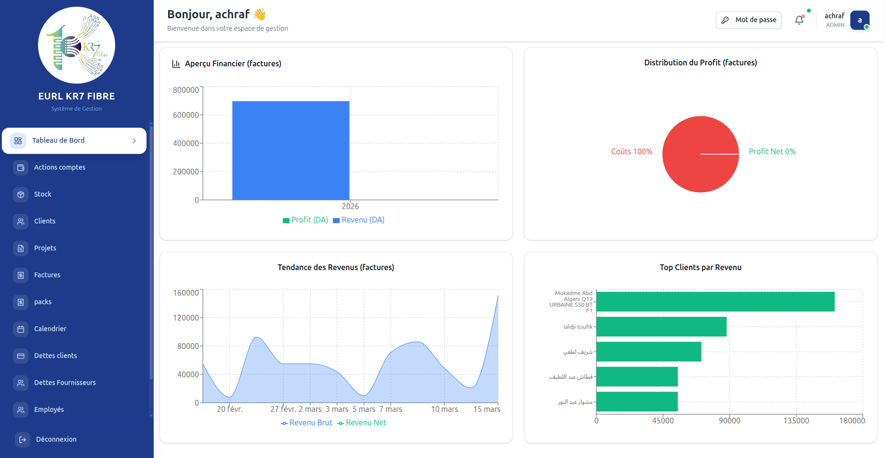
  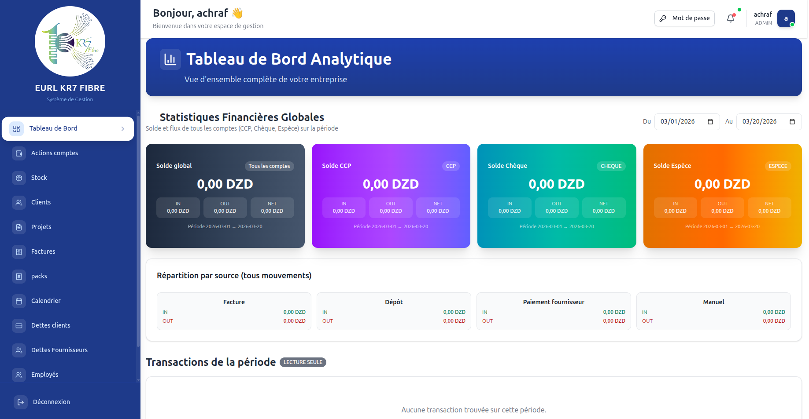
  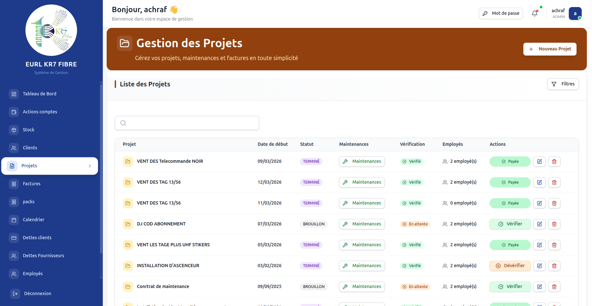
  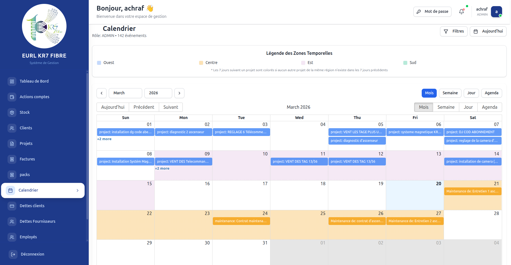
  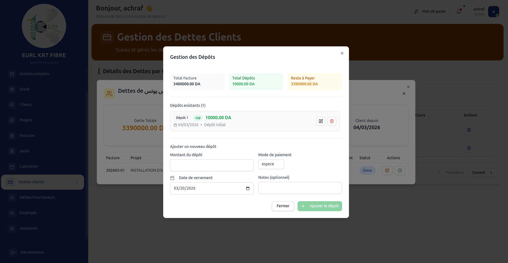

---

### 🔹 🎓 ProjectTrack – Academic Project Management Platform

A full-featured academic project management platform developed during my Master's studies at **ESI SBA**. The platform connects students, professors, companies, and administrators in one ecosystem, making project management more transparent, collaborative, and efficient.  

✅ Role-based dashboards tailored for students, professors, and administrators  
✅ Real-time collaboration with WebSocket technology (notifications, instant updates)  
✅ Full project lifecycle: proposal → validation → evaluation  
✅ Specialization-based organization (ISI, SIW, AI)  
✅ High-performance architecture (Redux + Redis caching)  
✅ Enterprise-grade security with JWT authentication and RBAC  

**Tech Stack**  
Frontend: React.js (TypeScript), Tailwind CSS, Redux, WebSockets  
Backend: Django REST Framework, PostgreSQL, Redis, JWT Authentication  

👉 [View Repository](https://github.com/Yacine-Djaaraoui/PFE)  

📸 *Some Screenshots:*  

  
  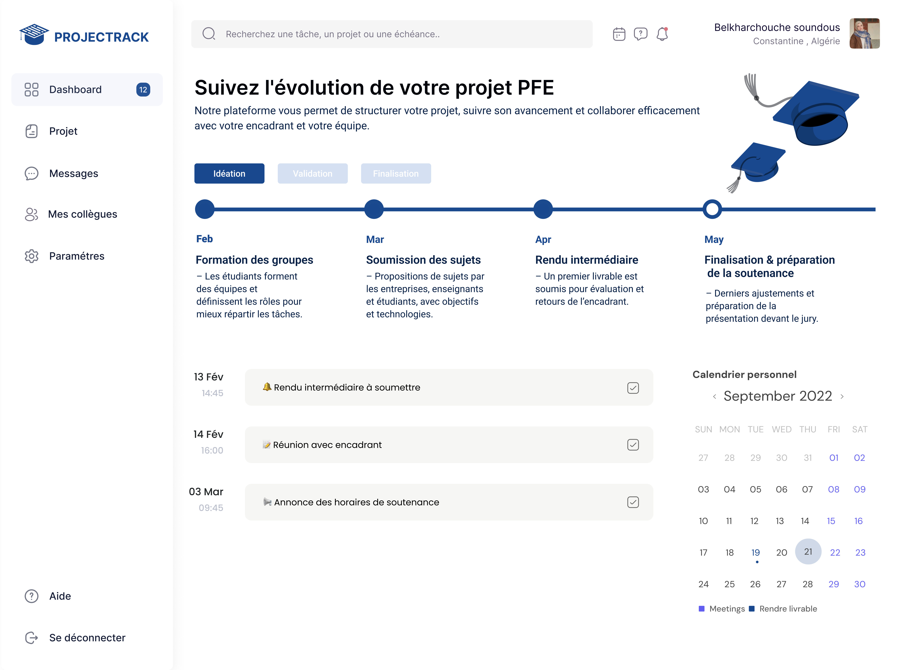
  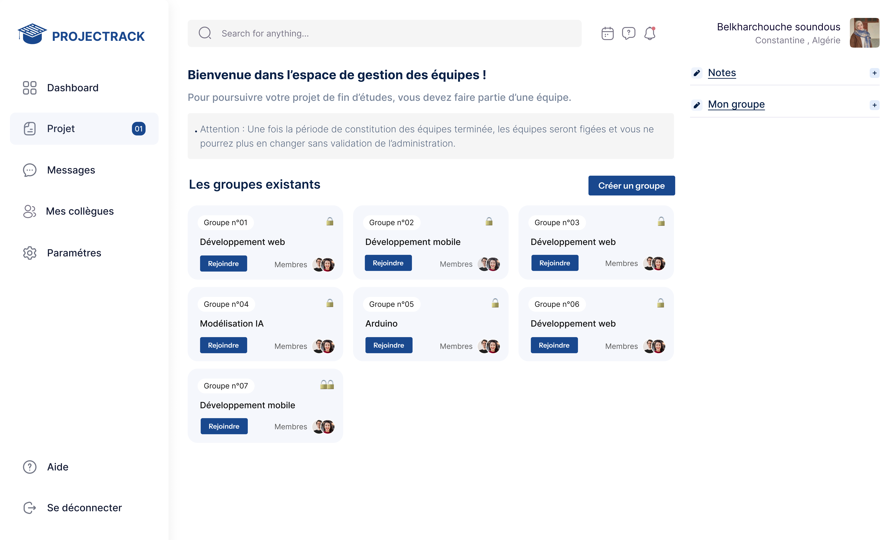
  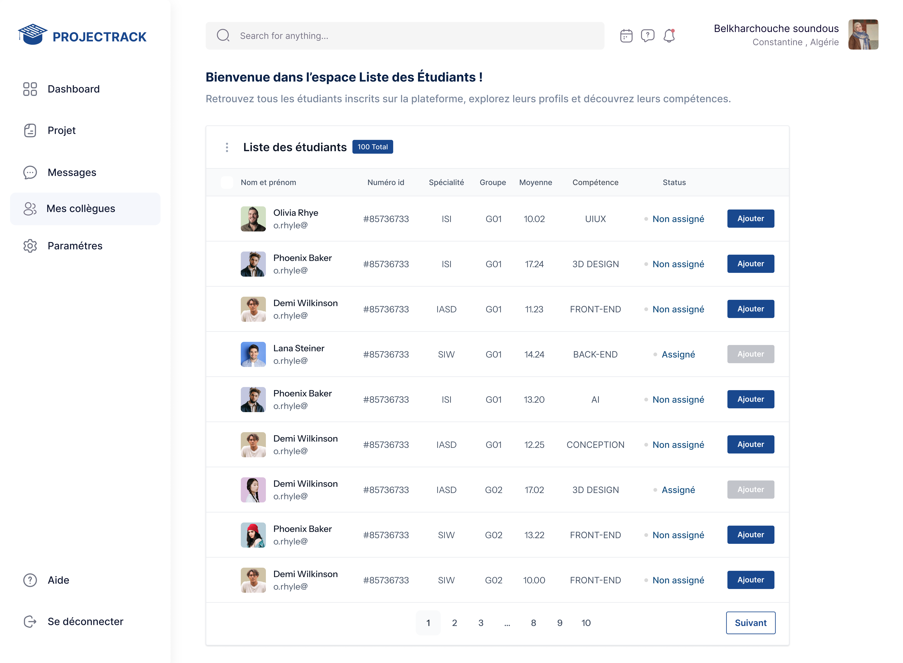
  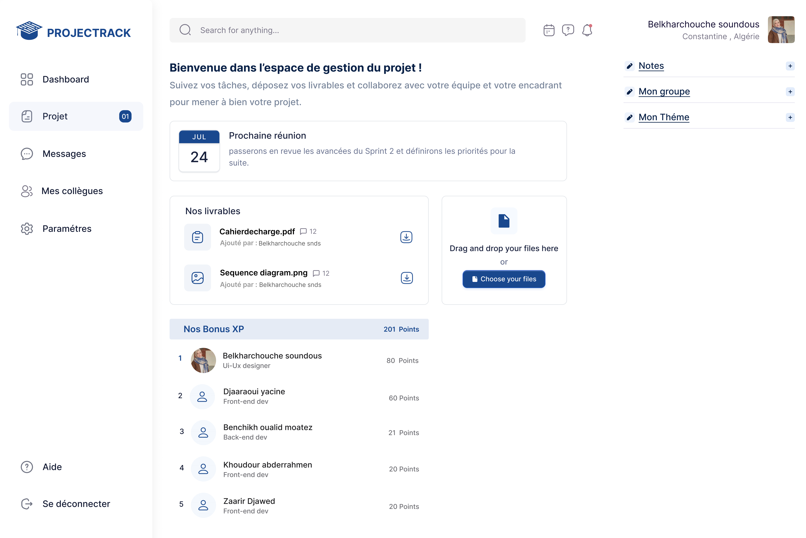
  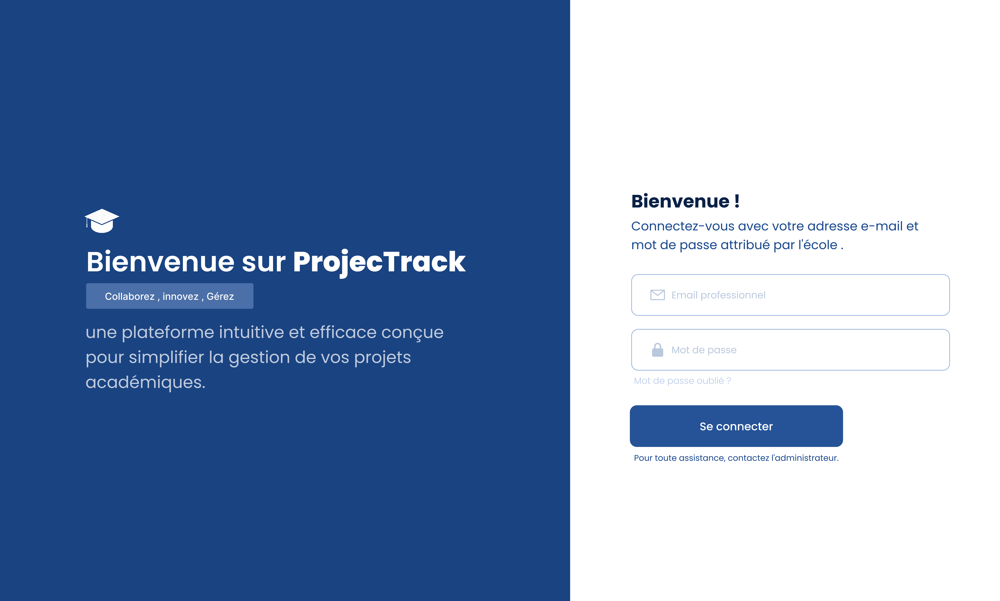

---

### 🔹 📚 The Official State Library Website of Tissemsilt

A modern, multilingual, and responsive website for the **official state library of Tissemsilt**. The platform delivers a seamless digital experience for visitors while providing administrators with powerful tools for content and facility management.  

🌐 **Live Website:** https://bplptissemsilt.dz/  

🌟 20+ fully responsive pages with dynamic UI components  
🌟 Multilingual support (Arabic, French, English)  
🌟 Room reservation system for study halls & facilities  
🌟 Book browsing & rating system with comment sections  
🌟 Dynamic testimonials to showcase community engagement  
🌟 Admin dashboard for content, events, and announcements  

**Tech Stack**  
Frontend: React, TypeScript, TailwindCSS, TanStack Query, Redux  
Backend: Django REST Framework, PostgreSQL  
Others: Docker, Git, modern deployment practices  

📌 Repository is **private** (due to client confidentiality).  

📸 *Some Screenshots:*  

  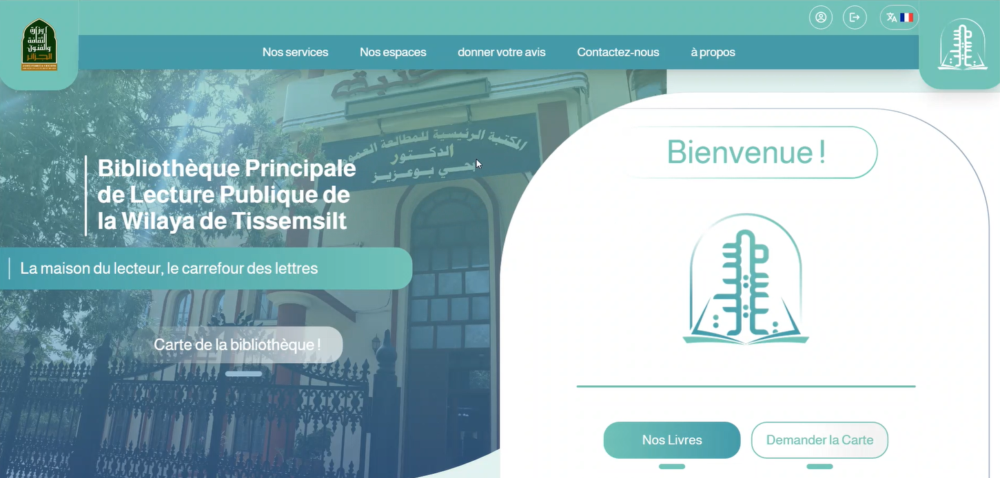
  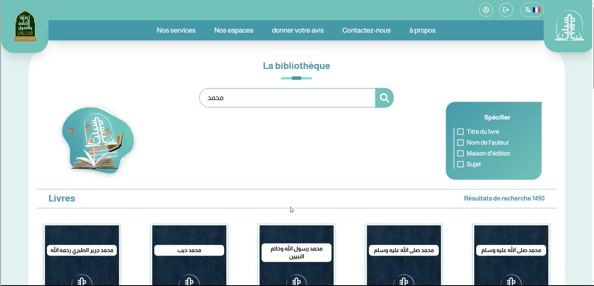
  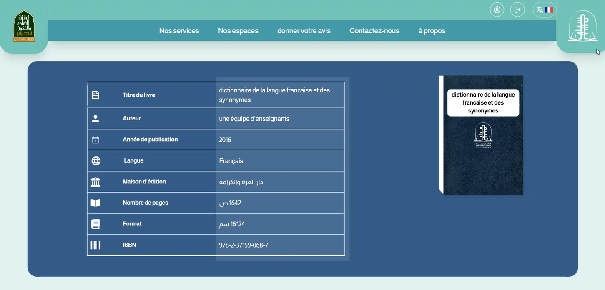
  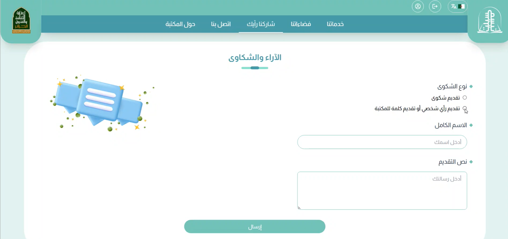
  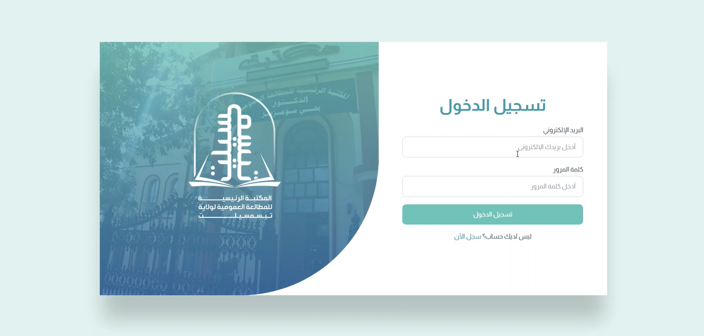
  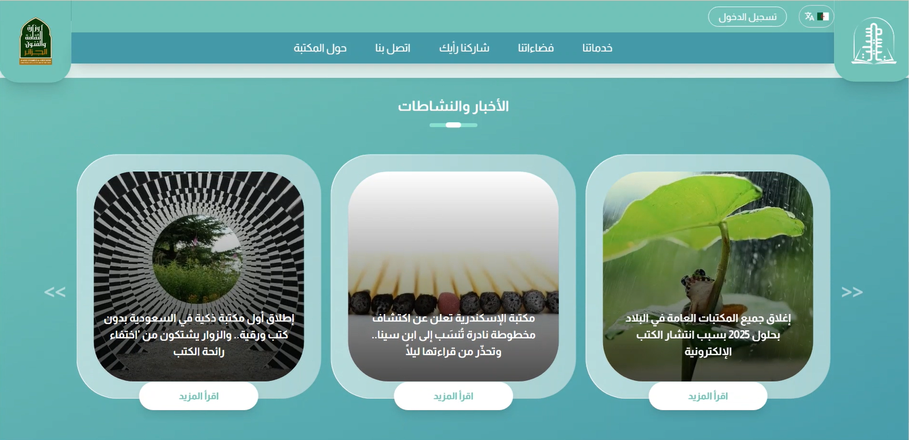

---

## 📊 GitHub Stats

  

---

## 🌐 Let's Connect
- 💼 [LinkedIn](https://www.linkedin.com/in/boufelghed-djawad-soufyane-848a92190/)  
- 📧 **ds.boufelghed@esi-sba.dz**

---

⭐️ *“Code is more than syntax — it’s about solving problems and creating experiences.”*
